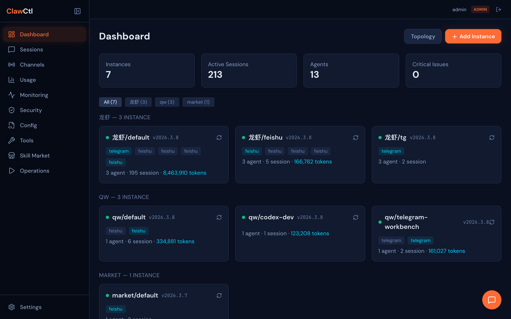
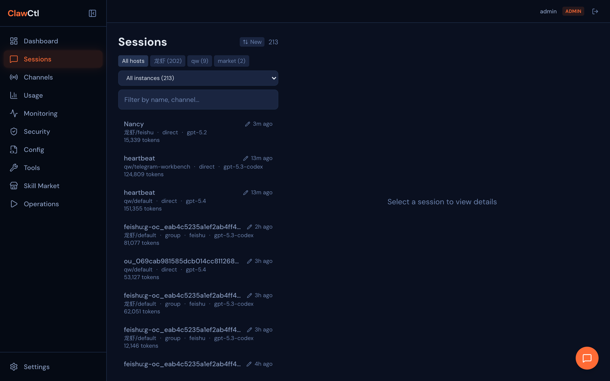
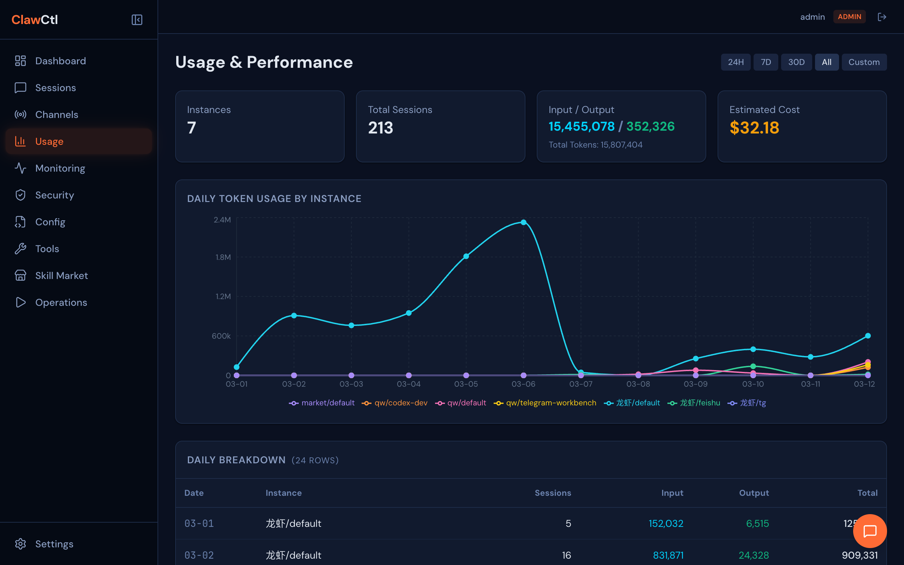
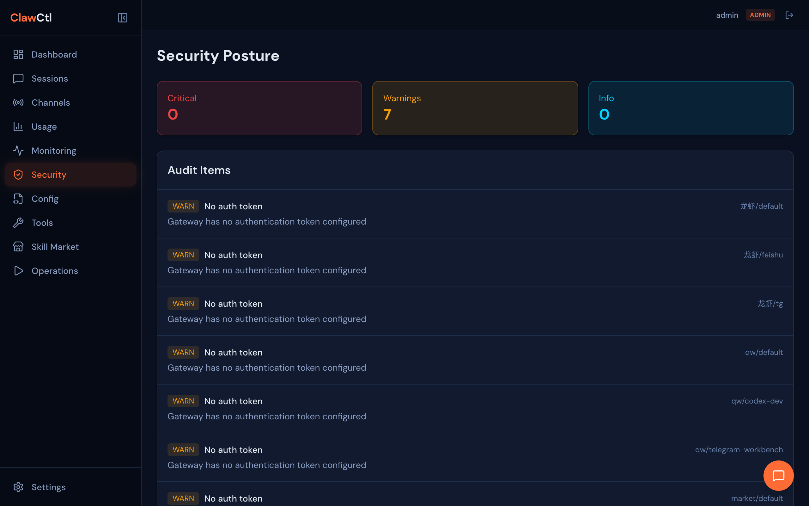
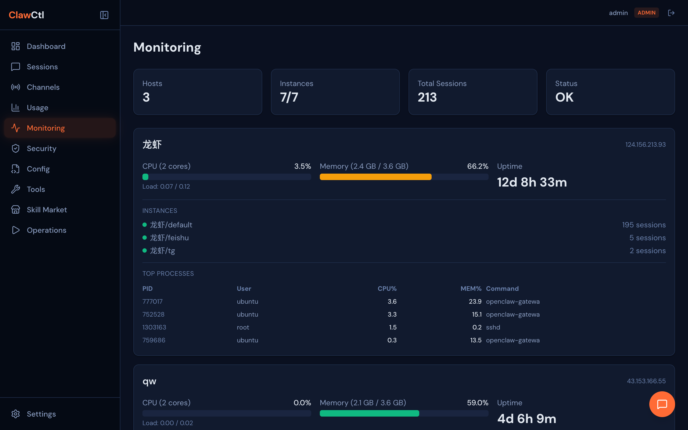
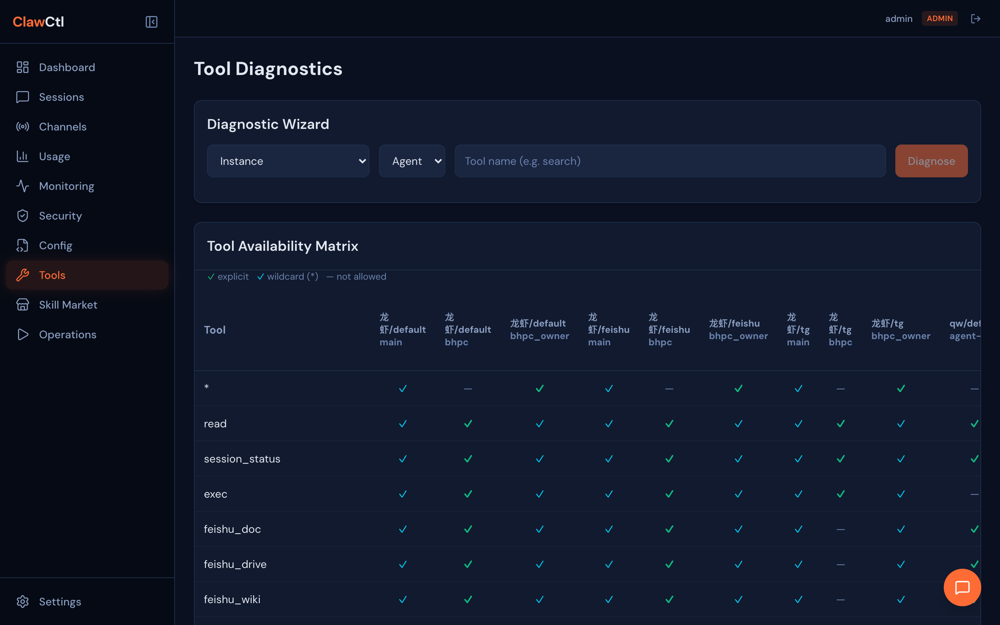
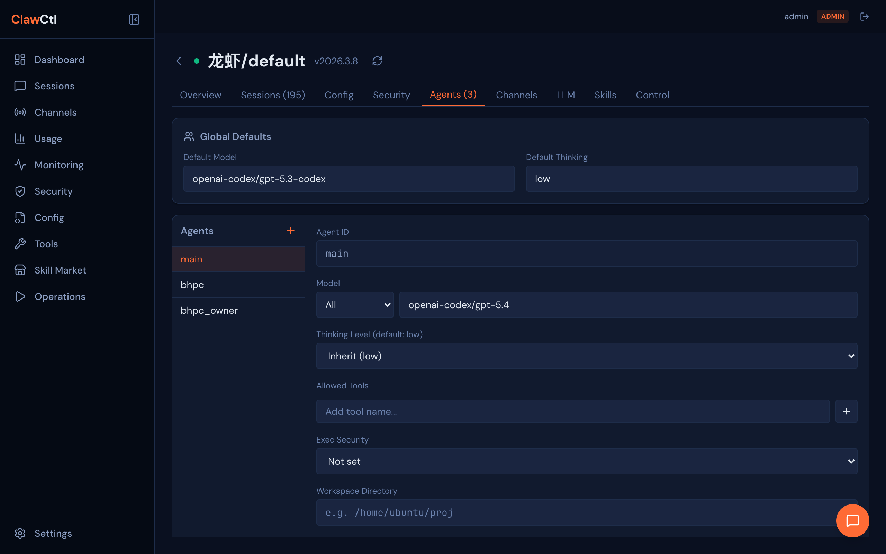

# ClawCtl — Tame Your AI Agent Fleet

[中文文档](README.zh-CN.md)

**Enterprise-grade OpenClaw cluster management center.** Monitor, secure, and manage all your AI agent instances from a single pane of glass — whether they run on one server or dozens.

> One dashboard. Every instance. Full control.

---

## Why ClawCtl?

Running multiple OpenClaw instances across servers quickly becomes unmanageable. Config drift goes unnoticed. Token costs are invisible. Security posture is a mystery. You find out something broke when users complain.

ClawCtl fixes this. It connects to every OpenClaw Gateway over SSH tunnels, pulls real-time data through the native WebSocket protocol, and gives you:

- **Instant visibility** — see every instance, session, and agent across all hosts at a glance
- **Proactive security** — audit tool permissions, detect prompt injection, enforce security templates
- **Deep diagnostics** — trace why a tool isn't working, compare configs, diff snapshots
- **AI-powered operations** — built-in AI assistant that reads configs, diagnoses issues, applies fixes, and restarts services — all through natural language
- **Zero exposure** — all traffic flows through encrypted SSH tunnels; Gateway ports never need to be public

---

## Screenshots

| Dashboard | Sessions | Usage |
|:---------:|:--------:|:-----:|
|  |  |  |

| Security | Monitoring | Tools |
|:--------:|:----------:|:-----:|
|  |  |  |

| Agent Configuration |
|:-------------------:|
|  |

## Features

### Dashboard & Topology
Real-time overview of all connected instances with interactive topology graph (ReactFlow). Instances are grouped by host with filter buttons — manage 3 instances or 30 with equal ease. One-click navigation into any instance's detail view.

### Session Intelligence
Browse chat sessions across all instances with two-level filtering (host → instance). Rename sessions with inline aliases for easy identification. Generate LLM-powered summaries with one click. Paginated message loading with sort toggle (oldest/newest first).

### Usage & Performance
Token consumption visualized with daily trend charts (Recharts). Break down input vs. output tokens per instance and agent. Filter by time range (24h / 7d / 30d / custom). Spot anomalies before they become cost surprises. Direct config links jump to the specific agent's settings.

### Security Posture
Audit tool permissions across every agent and instance. Channel policy matrix (DM / group / allowFrom). Agent binding inspection. **Prompt injection scanner** — paste any message and get an AI-powered risk assessment. **Permission templates** — define security presets (tool allowlists, exec policies, workspace restrictions) and apply them to agents across instances.

### Config Management
Side-by-side config comparison with intelligent diff — flattened dot-path keys highlight exactly what changed, what was added, and what was removed, presented in a focused modal dialog. Skill comparison shows ready/missing/disabled status across instances with clear iconography. Config snapshots with full diff history.

### Agent Configuration
Structured CRUD for agents — create, edit, delete agents with a form-based UI. Edit global defaults (model, thinking depth). Apply permission templates to agents with preview. Model combobox with available model list. Restart confirmation dialog after config changes.

### Channel Management
Full channel lifecycle management — view all connected channels across instances with detailed account-level status (connection state, last activity, reconnect attempts, errors). Edit channel policies (DM/group policy, allowlists) and messaging behavior (history limits, chunk settings) through a structured form. Operational controls: live connectivity probe, account logout, and enable/disable with restart confirmation. Top-level cross-instance channel overview for fleet-wide visibility.

### Lifecycle Control
Start, stop, and restart OpenClaw instances remotely. View and edit raw `openclaw.json` config files. Real-time log streaming (auto-detects file / journalctl --user / journalctl system). Config snapshots — create, compare, restore. Install, upgrade, or **uninstall** OpenClaw on remote hosts with Node.js version verification. Uninstall streams progress via SSE — stops processes, disables systemd services, removes the npm package, and verifies cleanup.

### Host Monitoring
Live CPU, memory, and uptime metrics for every remote host. **Abnormal process detection** — when CPU or memory is elevated, the top offending processes are listed with PID, user, CPU%, and MEM%. Server-side 30s cache with request deduplication prevents SSH connection storms.

### Tool Diagnostics
Cross-instance tool permission matrix — see at a glance which agents can use which tools. Step-by-step diagnostic engine: select instance → agent → tool, get a detailed pass/fail checklist with actionable suggestions. Fuzzy tool name matching for quick lookups.

### Operation Center
Centralized operation log with pagination, operator filtering, and date range search. Every lifecycle action (start/stop/restart, config change, scan) is recorded with timestamps and outcomes.

### AI Assistant
Configure your LLM provider (OpenAI / Anthropic / Azure / Ollama) with a two-level provider → model selection dropdown. Model lists are cached server-side (10-min TTL) with API-confirmed models merged on top of static presets. OpenAI OAuth supports both popup and manual URL copy for remote deployment scenarios. Unlock an intelligent copilot that lives inside every instance page. It can:

- **Diagnose problems** — "Why can't the bhpc agent use the exec tool?" → reads config, traces permission chain, pinpoints the issue
- **Modify configurations** — "Add a new agent called 'support' with read-only tools" → generates a config patch, creates a snapshot, applies the change
- **Restart services** — "Apply changes and restart" → triggers a graceful restart and confirms the instance is back online
- **Explain settings** — "What does thinkingDefault do?" → pulls built-in OpenClaw documentation and answers in context

All actions are audit-logged. Config changes create automatic snapshots so you can always roll back. The assistant understands your full environment — every host, instance, and their connection status.

---

## Auth & RBAC

Built-in session-based authentication with three role tiers:

| Role | Read | Write | User Management |
|------|------|-------|-----------------|
| **Admin** | All | All | Yes |
| **Operator** | All | Instances, Config, Tools, Operations, Sessions, Digest | No |
| **Auditor** | All | None (read-only compliance) | No |

First launch opens a setup wizard to create the initial admin account.

## Remote Host Discovery & SSH Tunneling

Add remote servers via SSH in Settings. ClawCtl connects over SSH, scans for `~/.openclaw*` configs, and auto-registers all discovered instances. Supports password and private key authentication. Credentials are AES-256-GCM encrypted at rest.

Since OpenClaw Gateway binds to `127.0.0.1` by default, ClawCtl automatically creates SSH port-forward tunnels to reach remote Gateway WebSocket ports. Tunnels are transparent — each discovered instance gets a local forwarded port and connects through it. **Your Gateway ports never need to be exposed to the internet.**

## Gateway Protocol

ClawCtl communicates with OpenClaw Gateway via its native WebSocket protocol:

1. **Challenge-Response Handshake** — Gateway sends a `connect.challenge` event; ClawCtl replies with a `connect` request including auth token
2. **Frame Format** — Requests: `{ type: "req", id, method, params }`, Responses: `{ type: "res", id, ok, payload }`
3. **Supported RPCs** — `agents.list`, `sessions.list`, `channels.status`, `skills.status`, `config.get`, `tools.catalog`, `chat.history`, and more

---

## Tech Stack

| Layer | Technology |
|-------|-----------|
| **Backend** | Hono + Node.js, SQLite (better-sqlite3), WebSocket (ws), ssh2 |
| **Frontend** | React + Tailwind CSS + Vite, React Router, ReactFlow, Recharts |
| **Auth** | HMAC-SHA256 session tokens, scryptSync password hashing, httpOnly cookies |
| **SSH** | ssh2-based remote discovery with automatic port-forward tunneling |
| **LLM** | Multi-provider (OpenAI / Anthropic / Azure / Ollama) for summaries, digest, and injection scanning |

## Quick Start

```bash
npm install
npm run dev
```

- Server: http://localhost:7100
- Vite dev server: http://localhost:7101 (proxies API to 7100)

On first launch, open the browser and create an admin account through the setup wizard.

## Usage Guide

### 1. First Launch — Create Admin Account

Open http://localhost:7101. The setup wizard will prompt you to create the first admin account.

### 2. Add Remote Hosts

Go to **Settings** > **Remote Hosts** > **+ Add Host**:

- **Host**: server IP (e.g. `10.0.1.100`)
- **Port**: SSH port (default `22`)
- **Username**: SSH user (e.g. `ubuntu`)
- **Auth Method**: Password or paste Private Key content
- Click **Add**

### 3. Scan for Instances

Click **Scan** next to a host (or **Scan All**). ClawCtl will SSH into the server, find all `~/.openclaw*` configs, and auto-register discovered instances.

### 4. Explore

- **Dashboard** — instance overview, topology graph, host-grouped cards
- **Sessions** — browse sessions by host/instance, set aliases, generate summaries
- **Channels** — cross-instance channel overview, click to manage per-instance
- **Usage** — token trends, per-instance/agent breakdown, cost visibility
- **Security** — permission audit, injection scanner, security templates
- **Config** — compare configs with smart diff, snapshot history
- **Tools** — permission matrix, step-by-step diagnostics
- **Monitoring** — host health, CPU/memory, abnormal process alerts
- **Operations** — audit trail of all lifecycle actions

### 5. User Management (Admin)

In **Settings** > **User Management**, create accounts for team members:

- **Admin** — full access including user management
- **Operator** — read everything, write to instances/config/tools/operations
- **Auditor** — read-only for compliance review

## Project Structure

```
packages/
  server/          # Hono API server
    src/
      api/         # REST route handlers
      auth/        # Auth system (password, session, RBAC, middleware)
      gateway/     # OpenClaw Gateway WebSocket client (challenge-response auth)
      hosts/       # Remote host management (SSH discovery, tunneling, crypto)
      instances/   # Instance manager & SQLite store
      lifecycle/   # Instance lifecycle (service control, config, install, snapshots)
      executor/    # CommandExecutor abstraction (local/SSH command execution)
      llm/         # Multi-provider LLM client
  web/             # React SPA
    src/
      pages/       # Dashboard, Sessions, Channels, Usage, Security, Config,
                   # Tools, Operations, Monitoring, Settings, Instance, Login
      components/  # Layout, shared UI (AgentForm, TemplateApplyModal, RestartDialog)
      hooks/       # useAuth, useInstances, useApi, etc.
      lib/         # API client
  cli/             # CLI entry point (npx clawctl)
```

## API Overview

All API routes require authentication (except `/api/auth/*` and `/api/health`).

| Endpoint | Methods | Description |
|----------|---------|-------------|
| `/api/auth/status` | GET | Check if setup is needed |
| `/api/auth/setup` | POST | Create initial admin (first-run only) |
| `/api/auth/login` | POST | Login, returns session cookie |
| `/api/auth/logout` | POST | Clear session |
| `/api/auth/me` | GET | Current user info |
| `/api/auth/users` | GET, POST | User management (admin only) |
| `/api/auth/users/:id` | PUT, DELETE | Update/delete user (admin only) |
| `/api/instances` | GET, POST | List/add instances |
| `/api/instances/:id` | DELETE | Remove instance |
| `/api/instances/:id/refresh` | POST | Refresh instance data |
| `/api/instances/:id/sessions` | GET | List sessions (with aliases) |
| `/api/instances/:id/sessions/:key` | GET | Session messages (paginated) |
| `/api/instances/:id/sessions/:key/summarize` | POST | LLM summary |
| `/api/instances/:id/sessions/:key/alias` | PUT | Set session alias |
| `/api/instances/:id/config` | GET | Instance config |
| `/api/instances/compare` | POST | Compare two configs |
| `/api/instances/overview` | GET | Security overview |
| `/api/instances/:id/security` | GET | Instance security detail |
| `/api/instances/templates` | GET, POST | Permission templates |
| `/api/instances/templates/:id` | DELETE | Delete template |
| `/api/instances/scan-message` | POST | Prompt injection scan |
| `/api/tools/matrix` | GET | Cross-instance tool matrix |
| `/api/tools/diagnose` | POST | Tool diagnostic |
| `/api/tools/:id/agents/:agentId/tools` | GET | Agent tool list |
| `/api/operations` | GET, POST | Operation log |
| `/api/settings` | GET, PUT | App settings (LLM config) |
| `/api/digest` | POST | Multi-instance digest |
| `/api/hosts` | GET, POST | Remote host management (admin only) |
| `/api/hosts/:id` | PUT, DELETE | Update/delete remote host (admin only) |
| `/api/hosts/:id/scan` | POST | SSH scan host for OpenClaw instances |
| `/api/hosts/scan-all` | POST | Scan all configured hosts |
| `/api/lifecycle/:id/status` | GET | Instance process status |
| `/api/lifecycle/:id/start` | POST | Start instance |
| `/api/lifecycle/:id/stop` | POST | Stop instance |
| `/api/lifecycle/:id/restart` | POST | Restart instance |
| `/api/lifecycle/:id/config-file` | GET, PUT | Read/write remote openclaw.json |
| `/api/lifecycle/:id/models` | GET | Extract model list from config |
| `/api/lifecycle/:id/providers` | GET | LLM providers (configured + auto-detected) |
| `/api/lifecycle/:id/agents` | PUT | Update agent config (structured) |
| `/api/lifecycle/:id/agents/:agentId` | DELETE | Remove agent from config |
| `/api/lifecycle/:id/channels` | GET | Channel status with account details |
| `/api/lifecycle/:id/channels/probe` | POST | Probe channel connectivity |
| `/api/lifecycle/:id/channels/logout` | POST | Logout channel account |
| `/api/lifecycle/:id/channels/config` | PUT | Update channel account config |
| `/api/lifecycle/:id/logs` | GET | Stream logs (SSE) |
| `/api/lifecycle/:id/snapshots` | GET, POST | List/create config snapshots |
| `/api/lifecycle/snapshots/:id` | GET | Get snapshot detail |
| `/api/lifecycle/snapshots/diff` | POST | Diff two snapshots |
| `/api/lifecycle/host/:hostId/versions` | GET | Node.js + OpenClaw versions |
| `/api/lifecycle/host/:hostId/install` | POST | Install/upgrade OpenClaw |
| `/api/lifecycle/host/:hostId/diagnose` | POST | Host diagnostics |
| `/api/monitoring/hosts` | GET | Host metrics (CPU, memory, uptime, top processes) |
| `/api/health` | GET | Health check |

## Docker

```bash
docker compose up --build
```

Mounts `~/.openclaw*` directories read-only for instance auto-discovery.

## Environment Variables

| Variable | Default | Description |
|----------|---------|-------------|
| `CLAWCTL_PORT` | `7100` | Server port |

## Testing

```bash
npm run test:unit          # Backend unit tests (369 tests)
npm run test:components    # Frontend component tests
npm run test:e2e           # Playwright E2E tests
npm run test:live          # Live integration tests (needs running OpenClaw)
```

## Security

- Passwords hashed with scryptSync (16-byte random salt)
- Session tokens are HMAC-SHA256 signed, stored in httpOnly/SameSite=Lax cookies
- Session secret auto-generated and persisted in SQLite
- `.gitignore` excludes `.env`, `*.db`, credentials, keys, and secrets
- Write operations enforce role-based permissions at the middleware level
- SSH credentials (passwords, private keys) are AES-256-GCM encrypted in SQLite
- SSH tunnels are created on-demand; Gateway traffic never leaves the SSH channel
- Gateway auth tokens are read from remote `openclaw.json` and used in challenge-response handshake
- Built-in prompt injection scanner for message-level threat detection

## License

[MIT](LICENSE)
