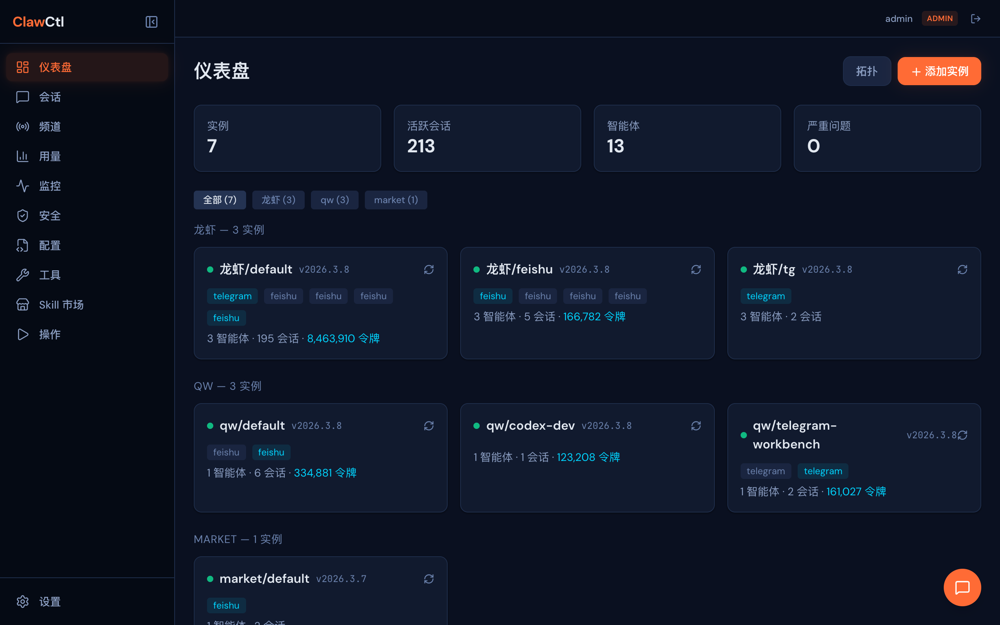
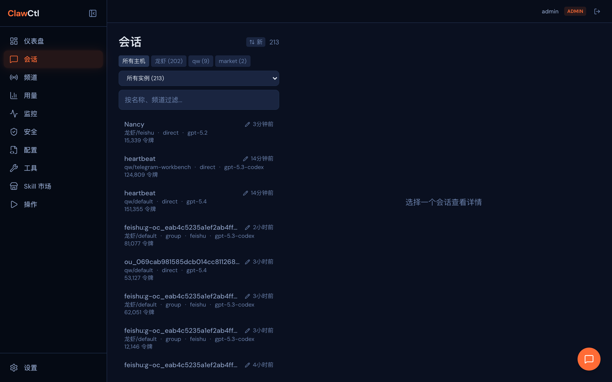
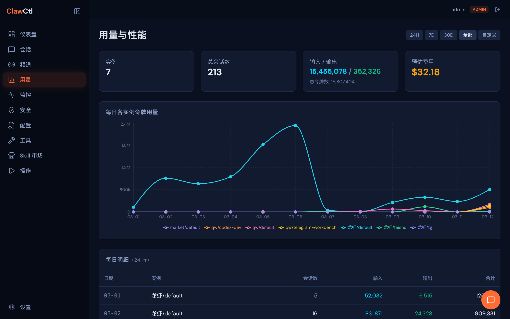
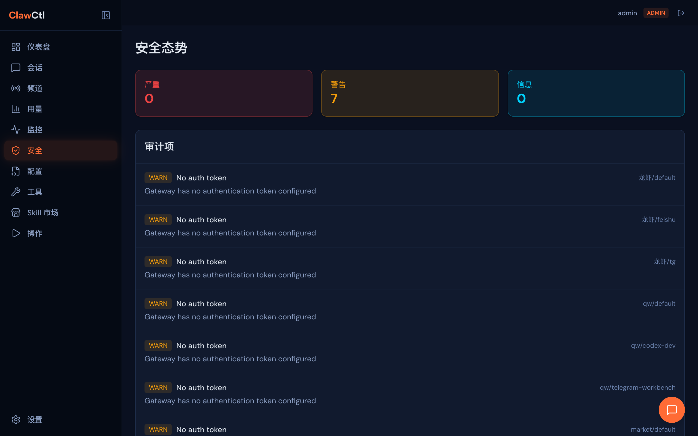
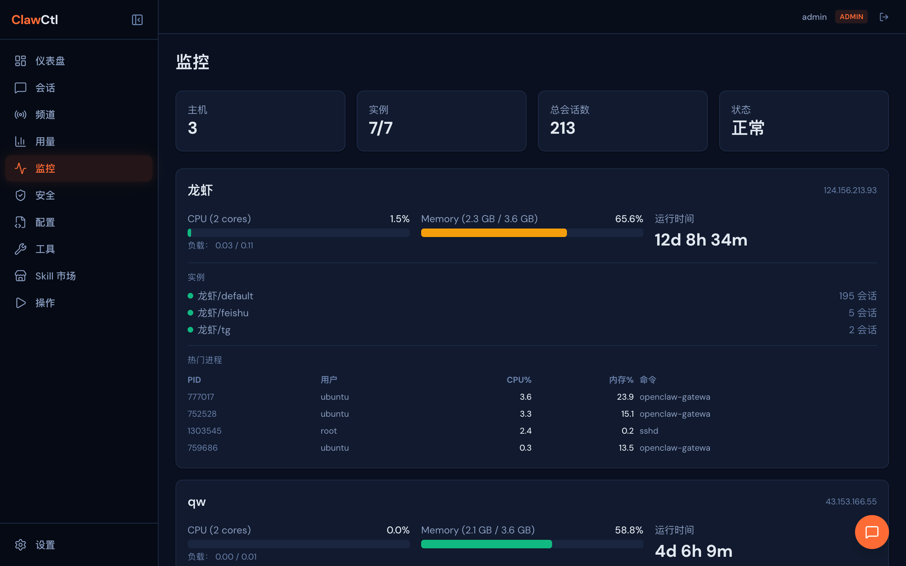
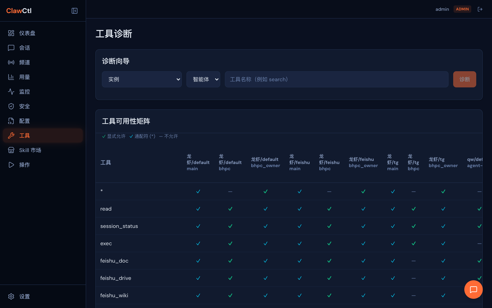
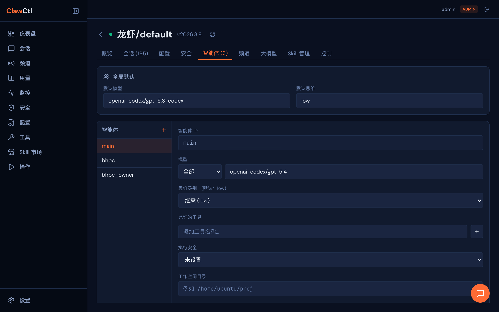
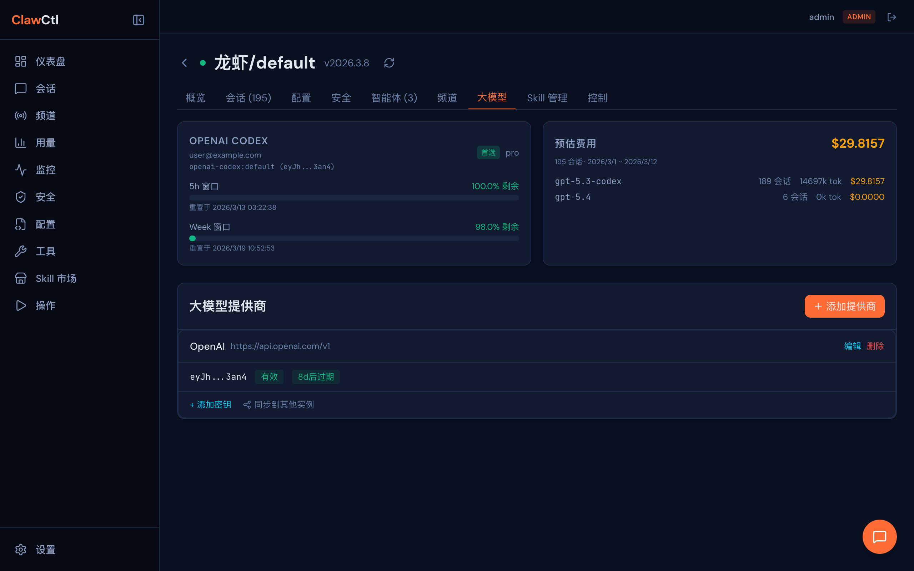
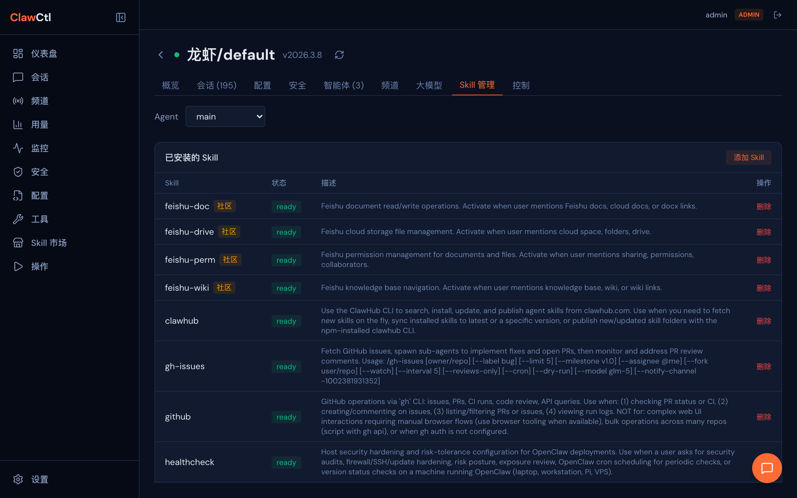

# ClawCtl — 驯服你的 AI Agent 舰队

[English](README.md)

**企业级 OpenClaw 集群管理中心。** 无论实例运行在一台还是几十台服务器上，都能通过一个面板完成监控、安全审计和全面管控。

> 一个面板，所有实例，完全掌控。

---

## 为什么需要 ClawCtl？

多实例 OpenClaw 跨服务器运行时，管理很快就会失控：配置漂移无人察觉，Token 成本不可见，安全态势是个谜，出了问题只能等用户反馈。

ClawCtl 解决这一切。它通过 SSH 隧道连接每个 OpenClaw Gateway，使用原生 WebSocket 协议拉取实时数据，让你获得：

- **即时可视** — 一眼纵览所有主机上的每个实例、会话和 Agent
- **主动安全** — 审计工具权限、检测提示词注入、强制执行安全模板
- **深度诊断** — 追踪工具不可用的原因、对比配置、Diff 快照
- **AI 智能运维** — 内置 AI 助手，用自然语言读取配置、诊断问题、修改设置、重启服务，一句话搞定
- **零暴露** — 所有流量走加密 SSH 隧道，Gateway 端口无需公网暴露

---

## 界面预览

| 仪表盘 | 会话 | 用量 |
|:------:|:----:|:----:|
|  |  |  |

| 安全审计 | 主机监控 | 工具诊断 |
|:--------:|:--------:|:--------:|
|  |  |  |

| Agent 配置 | 模型与密钥管理 | Skill 管理 |
|:----------:|:------------:|:----------:|
|  |  |  |

## 功能模块

### 仪表盘与拓扑图
所有已连接实例的实时概览，交互式拓扑图（ReactFlow）。实例按主机分组，带过滤按钮 — 管 3 个实例和管 30 个一样轻松。点击实例卡片即可进入详情页。

### 会话智能
跨实例浏览聊天会话，支持两级过滤（主机 → 实例）。为会话设置别名，方便识别。一键生成 LLM 摘要。消息分页加载，支持正序/倒序切换。

### 用量与性能
Token 消耗趋势图（Recharts），区分输入/输出 Token。按实例和 Agent 细分。支持时间范围筛选（24h / 7d / 30d / 自定义）。在成本失控之前发现异常。配置链接直接跳转到对应 Agent 设置。

### 安全态势
审计每个 Agent 和实例的工具权限。Channel 策略矩阵（DM / 群组 / allowFrom）。Agent 绑定检查。**提示词注入扫描** — 粘贴任意消息，AI 实时评估风险等级。**权限模板** — 定义安全预设（工具白名单、执行策略、工作空间限制），一键应用到跨实例的 Agent。

### 配置管理
智能 Diff 对比配置 — 扁平化为 dot-path 键值，精确高亮变更、新增和删除项，以聚焦的弹窗展示。技能对比展示 ready/missing/disabled 三态图标。配置快照支持创建、对比、历史回溯。

### Agent 配置
结构化的 Agent CRUD — 表单式创建、编辑、删除 Agent。编辑全局默认值（模型、思考深度）。应用权限模板并预览变更。模型下拉框展示可用模型列表。配置变更后的重启确认对话框。

### 频道管理
完整的频道生命周期管理 — 查看所有跨实例连接的频道，展示账户级详情（连接状态、最后活跃、重连次数、错误）。编辑频道策略（DM/群组策略、白名单）和消息行为（历史限制、分块设置）。运维操作：在线连通性探测、账户登出、启停控制与重启确认。顶层跨实例频道概览，全局可视。

### 生命周期管控
远程启动、停止、重启 OpenClaw 实例。查看和编辑原始 `openclaw.json` 配置文件。实时日志流（自动检测 file / journalctl --user / journalctl system）。配置快照 — 创建、对比、恢复。在远程主机上安装、升级或**卸载** OpenClaw，含 Node.js 版本校验。卸载通过 SSE 流式推送进度 — 停止进程、禁用 systemd 服务、移除 npm 包并验证清理。

### 主机监控
实时查看每台远程主机的 CPU、内存和运行时间。**异常进程检测** — 当 CPU 或内存偏高时，自动列出 Top 异常进程（PID、用户、CPU%、MEM%）。服务端 30s 缓存 + 请求去重，避免 SSH 连接风暴。

### 工具诊断
跨实例工具权限矩阵 — 一眼看清哪些 Agent 能用哪些工具。分步诊断引擎：选择实例 → Agent → 工具，获得详细的 Pass/Fail 检查清单和可操作建议。支持工具名模糊匹配。

### 运维中心
集中式操作日志，支持分页、操作人筛选和日期范围搜索。所有生命周期操作（启停、配置变更、扫描）均记录时间戳和结果。

### AI 助手
配置 LLM 供应商（OpenAI / Anthropic / Azure / Ollama）后，解锁内嵌于每个实例页面的智能运维副驾。它可以：

- **智能诊断** — "为什么 bhpc agent 不能用 exec 工具？" → 自动读取配置，追踪权限链路，精准定位问题
- **修改配置** — "新建一个叫 support 的 agent，只开放 read 工具" → 生成配置补丁，自动创建快照，一键应用
- **重启服务** — "应用变更并重启" → 触发优雅重启，确认实例恢复在线
- **答疑解惑** — "thinkingDefault 是什么意思？" → 调取内置 OpenClaw 文档，结合当前配置上下文回答

所有操作自动记录审计日志。配置变更前自动创建快照，随时可回滚。AI 助手感知你的完整环境 — 每台主机、每个实例及其连接状态。

### 技能市场
双 Tab 界面：**市场**用于发现技能，**已安装**用于管理技能。按分类浏览内置技能目录，支持网格/列表切换。搜索时自动触发 **ClawHub 社区市场** — 结果流式加载，支持分页（"加载更多"）。**两阶段渐进加载** — 先快速返回搜索结果，再异步加载星标数、下载量、作者等信息。社区技能展示信任信号（作者、星标、下载量）。**VirusTotal 可疑技能检测** — 被标记的技能在市场卡片和已安装列表中均显示红色 `ShieldAlert` 徽章。安装可疑技能需用户二次确认。技能通过 SSE 流式安装到多个实例，显示逐实例进度。**已安装** Tab 展示每个实例的技能列表，标注社区/可疑状态，支持一键卸载。远程主机上的 `clawhub` CLI 会在需要时自动安装。

---

## 认证与权限

内置基于会话的认证系统，三级角色划分：

| 角色 | 读 | 写 | 用户管理 |
|------|----|----|----------|
| **超管** (Admin) | 全部 | 全部 | 有 |
| **运维** (Operator) | 全部 | 实例、配置、工具、运维、会话、摘要 | 无 |
| **审计** (Auditor) | 全部 | 无（只读合规审查） | 无 |

首次启动会引导创建初始管理员账户。

## 远程主机发现与 SSH 隧道

在设置页面通过 SSH 添加远程服务器。ClawCtl 通过 SSH 连接远程机器，扫描 `~/.openclaw*` 配置目录，自动注册所有发现的实例。支持密码和私钥两种认证方式。凭证使用 AES-256-GCM 加密存储。

由于 OpenClaw Gateway 默认绑定 `127.0.0.1`，ClawCtl 会自动创建 SSH 端口转发隧道来连接远程 Gateway 的 WebSocket 端口。隧道对用户透明 — 每个发现的实例都会分配一个本地转发端口。**你的 Gateway 端口完全不需要暴露到公网。**

## Gateway 通信协议

ClawCtl 使用 OpenClaw Gateway 的原生 WebSocket 协议通信：

1. **质询-响应握手** — Gateway 发送 `connect.challenge` 事件，ClawCtl 回复包含 auth token 的 `connect` 请求
2. **帧格式** — 请求 `{ type: "req", id, method, params }`，响应 `{ type: "res", id, ok, payload }`
3. **支持的 RPC** — `agents.list`、`sessions.list`、`channels.status`、`skills.status`、`config.get`、`tools.catalog`、`chat.history` 等

---

## 国际化 (i18n)

前端支持**中文**和**英文**，自动检测语言：

- **自动检测**：跟随浏览器/系统语言偏好
- **手动切换**：设置页语言下拉框，持久化到 localStorage (`clawctl-lang`)
- **技术栈**：`react-i18next` + `i18next` + `i18next-browser-languagedetector`
- **语言文件**：`packages/web/src/locales/en.json` 和 `zh.json`

## 技术栈

| 层 | 技术 |
|----|------|
| **后端** | Hono + Node.js, SQLite (better-sqlite3), WebSocket (ws), ssh2 |
| **前端** | React + Tailwind CSS + Vite, React Router, ReactFlow, Recharts |
| **i18n** | react-i18next, i18next-browser-languagedetector (中文 + 英文) |
| **认证** | HMAC-SHA256 会话令牌, scryptSync 密码哈希, httpOnly cookies |
| **SSH** | 基于 ssh2 的远程发现，自动端口转发隧道 |
| **LLM** | 多供应商 (OpenAI / Anthropic / Azure / Ollama)，用于摘要、简报和注入扫描 |

## 快速开始

```bash
npm install
npm run dev
```

- 服务端: http://localhost:7100
- Vite 开发服务器: http://localhost:7101 (API 代理到 7100)

首次启动后在浏览器中完成管理员账户创建。

## 使用指南

### 1. 首次启动 — 创建管理员账户

在浏览器中打开 http://localhost:7101 ，设置向导会引导你创建第一个管理员账户。

### 2. 添加远程主机

进入 **Settings** > **Remote Hosts** > **+ Add Host**：

- **Host**：服务器 IP（如 `10.0.1.100`）
- **Port**：SSH 端口（默认 `22`）
- **Username**：SSH 用户名（如 `ubuntu`）
- **Auth Method**：选择密码，或粘贴私钥内容
- 点击 **Add**

### 3. 扫描实例

点击主机旁的 **Scan**（或 **Scan All**）。ClawCtl 会通过 SSH 连接服务器，查找所有 `~/.openclaw*` 配置，自动注册发现的实例。

### 4. 开始使用

- **Dashboard** — 实例概览、拓扑图、按主机分组的实例卡片
- **Sessions** — 按主机/实例浏览会话，设置别名，生成摘要
- **Channels** — 跨实例频道概览，点击管理单个实例
- **Usage** — Token 趋势图，按实例/Agent 细分，成本可视化
- **Security** — 权限审计、注入扫描、安全模板
- **Config** — 智能 Diff 对比配置，快照历史
- **Skills** — 技能市场（ClawHub 社区搜索）、已安装技能管理、可疑检测
- **Tools** — 权限矩阵，分步诊断
- **Monitoring** — 主机健康、CPU/内存、异常进程告警
- **Operations** — 所有生命周期操作的审计轨迹

### 5. 用户管理（超管）

在 **Settings** > **User Management** 中为团队成员创建账户：

- **Admin（超管）** — 完全访问权限，包括用户管理
- **Operator（运维）** — 读取全部，可写实例/配置/工具/运维
- **Auditor（审计）** — 只读访问，用于合规审查

## 项目结构

```
packages/
  server/          # Hono API 服务端
    src/
      api/         # REST 路由处理
      auth/        # 认证系统（密码、会话、RBAC、中间件）
      gateway/     # OpenClaw Gateway WebSocket 客户端（质询-响应认证）
      hosts/       # 远程主机管理（SSH 发现、隧道、加密）
      instances/   # 实例管理器与 SQLite 存储
      lifecycle/   # 实例生命周期（进程控制、配置、安装、快照）
      executor/    # CommandExecutor 抽象（本地/SSH 命令执行）
      skills/      # 技能目录、ClawHub 市场集成
      llm/         # 多供应商 LLM 客户端
  web/             # React 单页应用
    src/
      pages/       # Dashboard, Sessions, Channels, Usage, Security, Config, Skills,
                   # Tools, Operations, Monitoring, Settings, Instance, Login
      components/  # 布局、通用 UI（AgentForm, TemplateApplyModal, RestartDialog）
      hooks/       # useAuth, useInstances, useApi 等
      lib/         # API 客户端
  cli/             # CLI 入口 (npx clawctl)
```

## API 概览

所有 API 路由需要认证（`/api/auth/*` 和 `/api/health` 除外）。

| 端点 | 方法 | 说明 |
|------|------|------|
| `/api/auth/status` | GET | 检查是否需要初始化 |
| `/api/auth/setup` | POST | 创建初始管理员（仅首次） |
| `/api/auth/login` | POST | 登录，返回会话 cookie |
| `/api/auth/logout` | POST | 注销 |
| `/api/auth/me` | GET | 当前用户信息 |
| `/api/auth/users` | GET, POST | 用户管理（仅超管） |
| `/api/auth/users/:id` | PUT, DELETE | 更新/删除用户（仅超管） |
| `/api/instances` | GET, POST | 列出/添加实例 |
| `/api/instances/:id` | DELETE | 移除实例 |
| `/api/instances/:id/refresh` | POST | 刷新实例数据 |
| `/api/instances/:id/sessions` | GET | 会话列表（含别名） |
| `/api/instances/:id/sessions/:key` | GET | 会话消息（分页） |
| `/api/instances/:id/sessions/:key/summarize` | POST | LLM 摘要 |
| `/api/instances/:id/sessions/:key/alias` | PUT | 设置会话别名 |
| `/api/instances/:id/config` | GET | 实例配置 |
| `/api/instances/compare` | POST | 对比两个实例配置 |
| `/api/instances/overview` | GET | 安全概览 |
| `/api/instances/:id/security` | GET | 实例安全详情 |
| `/api/instances/templates` | GET, POST | 权限模板 |
| `/api/instances/templates/:id` | DELETE | 删除模板 |
| `/api/instances/scan-message` | POST | 提示词注入扫描 |
| `/api/tools/matrix` | GET | 跨实例工具矩阵 |
| `/api/tools/diagnose` | POST | 工具诊断 |
| `/api/tools/:id/agents/:agentId/tools` | GET | Agent 工具列表 |
| `/api/operations` | GET, POST | 操作日志 |
| `/api/settings` | GET, PUT | 应用设置（LLM 配置） |
| `/api/skills` | GET | 内置技能目录及分类 |
| `/api/skills/search` | GET | 搜索技能（内置 + ClawHub），支持 `offset`/`limit` 分页 |
| `/api/skills/templates` | GET | 技能场景模板 |
| `/api/skills/clawhub/details` | GET | 批量获取 ClawHub 技能统计（星标、下载量、可疑状态） |
| `/api/skills/install` | POST | 向实例安装技能（SSE 流式进度） |
| `/api/skills/uninstall` | DELETE | 从实例卸载技能 |
| `/api/digest` | POST | 多实例简报 |
| `/api/hosts` | GET, POST | 远程主机管理（仅超管） |
| `/api/hosts/:id` | PUT, DELETE | 更新/删除远程主机（仅超管） |
| `/api/hosts/:id/scan` | POST | SSH 扫描主机上的 OpenClaw 实例 |
| `/api/hosts/scan-all` | POST | 扫描所有已配置主机 |
| `/api/lifecycle/:id/status` | GET | 实例进程状态 |
| `/api/lifecycle/:id/start` | POST | 启动实例 |
| `/api/lifecycle/:id/stop` | POST | 停止实例 |
| `/api/lifecycle/:id/restart` | POST | 重启实例 |
| `/api/lifecycle/:id/config-file` | GET, PUT | 读写远程 openclaw.json |
| `/api/lifecycle/:id/models` | GET | 从配置提取模型列表 |
| `/api/lifecycle/:id/providers` | GET | LLM 供应商（已配置 + 自动发现） |
| `/api/lifecycle/:id/agents` | PUT | 更新 Agent 配置（结构化） |
| `/api/lifecycle/:id/agents/:agentId` | DELETE | 删除 Agent |
| `/api/lifecycle/:id/channels` | GET | 频道状态及账户详情 |
| `/api/lifecycle/:id/channels/probe` | POST | 探测频道连通性 |
| `/api/lifecycle/:id/channels/logout` | POST | 登出频道账户 |
| `/api/lifecycle/:id/channels/config` | PUT | 更新频道账户配置 |
| `/api/lifecycle/:id/logs` | GET | 日志流（SSE） |
| `/api/lifecycle/:id/snapshots` | GET, POST | 列出/创建配置快照 |
| `/api/lifecycle/snapshots/:id` | GET | 快照详情 |
| `/api/lifecycle/snapshots/diff` | POST | 快照 Diff |
| `/api/lifecycle/host/:hostId/versions` | GET | Node.js + OpenClaw 版本 |
| `/api/lifecycle/host/:hostId/install` | POST | 安装/升级 OpenClaw |
| `/api/lifecycle/host/:hostId/diagnose` | POST | 主机诊断 |
| `/api/monitoring/hosts` | GET | 主机指标（CPU、内存、运行时间、Top 进程） |
| `/api/health` | GET | 健康检查 |

## Docker 部署

```bash
docker compose up --build
```

自动挂载 `~/.openclaw*` 目录（只读）用于实例自动发现。

## 环境变量

| 变量 | 默认值 | 说明 |
|------|--------|------|
| `CLAWCTL_PORT` | `7100` | 服务端口 |

## 测试

```bash
npm run test:unit          # 后端单元测试 (482 tests)
npm run test:components    # 前端组件测试
npm run test:e2e           # Playwright E2E 测试
npm run test:live          # 在线集成测试（需要运行中的 OpenClaw）
```

## 安全

- 密码使用 scryptSync 哈希（16 字节随机盐）
- 会话令牌采用 HMAC-SHA256 签名，存储于 httpOnly/SameSite=Lax cookie
- 会话密钥自动生成并持久化到 SQLite
- `.gitignore` 排除 `.env`、`*.db`、凭证、密钥等敏感文件
- 写操作在中间件层面强制执行基于角色的权限检查
- SSH 凭证（密码、私钥）在 SQLite 中使用 AES-256-GCM 加密存储
- SSH 隧道按需创建，Gateway 流量始终通过 SSH 通道传输
- Gateway 认证令牌从远程 `openclaw.json` 读取，用于质询-响应握手
- 内置提示词注入扫描，消息级威胁检测

## 许可证

[MIT](LICENSE)
